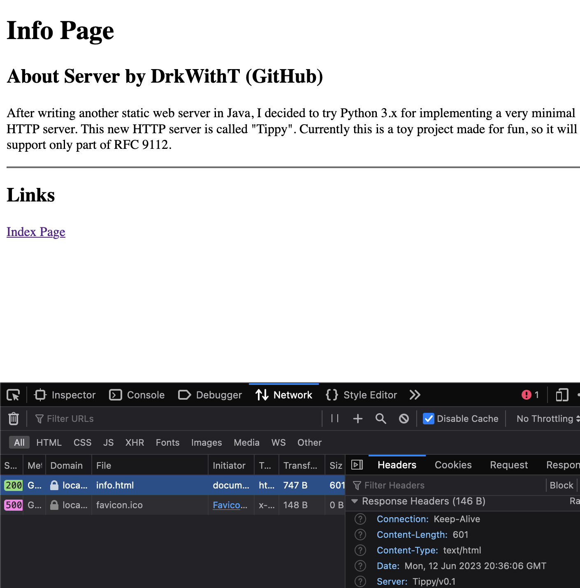

# README
## Project: "Tippy" HTTP/1.1 Server

### Brief
Lately I've been on an HTTP (1.1) server writing frenzy, and I decided to try Python 3.x for implementing a very minimal, single-threaded HTTP server. This is a toy project made only for learning purposes rather than production uses. Finally, I credit the "HTTP Made Really Easy" guide and _RFC 9112_ as my references. Feel free to fork, etc.

### Supported HTTP Features:
 - Basic message reading:
    - Basic syntax checks are done.
    - Headers such as `Host`, `Content-Length` and `Content-Type` are checked.
 - Persistent or closing connection handling.
 - HEAD and GET methods.
 - Will have chunked message handling soon?
 - Will have cache header checks and 304 responses soon?

### Current Bugs:
 1. On connection problems, the server may give malformed responses such as a "run-on" response message with multiple status lines and header groups. As of now, I am at a loss on how to fix this.
   - This usually happens with `curl` using HTTP 1.1!

### Old Sample Run:

### Some cURL Test Commands:
 - `curl --verbose -I http://localhost:8080/index.html` (HEAD of static resource)
 - `curl --verbose -X GET http://localhost:8080/index.html` (GET page)
 - `curl --verbose -X GET http://localhost:8080/info.html` (GET page)
 - `curl --verbose -X GET http://localhost:8080/index.html -H "Connection: Close" -H "If-Modified-Since: Mon, 12 Jun 2023 23:59:59 GMT"` (GET page with update date check... modify `public/index.html` to test this.)

### Things To Add??
 1. Support 100 Continue. (To do...)
 2. Support chunked transfer encoding. (To be tested...)
 3. Respect requests with `If-Modified-Since` or `If-Unmodified-Since`. Update resource classes to store load date for crude "update" date to reference. (Partially tested...)
